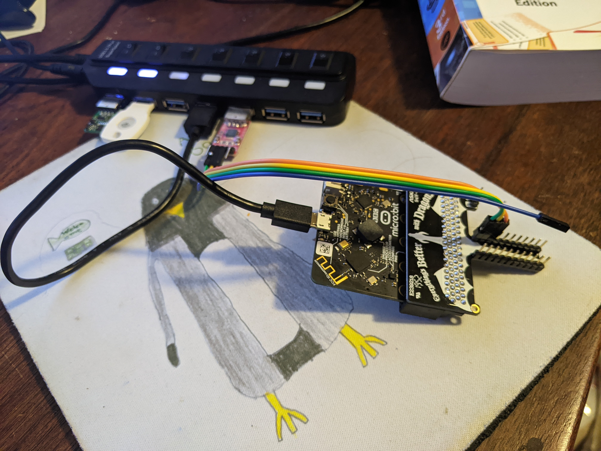

# mb2-external-serial
Bart Massey 2023

This is the `serial-hal-blocking-echo` example from the
[`microbit` crate](https://crates.io/crates/microbit). It
has been modified to be MicroBit V2 only, to build and run a
bit more easily, and to work with external serial hardware
rather than the debug serial interface.

## Hardware Setup

I set this up using the MicroBit V2, the [AdaFruit
DragonTail](https://www.adafruit.com/product/3695) to get
the pins out conveniently, a third-party [TTL Serial
Adapter](https://www.amazon.com/dp/B08ZS6H9VS) that came
with the necessary cable, and a USB hub.

* Start with everything powered off and disconnected (of
  course).

* Plug the DragonTail onto the edge card connector of the
  MB2 *oriented so that the pins on the back of the
  DragonTail are also on the back of the MB2.* (Do not get
  this upside down.)

* Plug a wire onto the GND pin of the Serial Adapter.
  Plug the other end of that wire into a pin marked "-" on
  the DragonTail. I recommend the pin next to Pin 0 on the
  DragonTail, as it will make the next steps slightly
  easier.

* Plug a wire onto the RX pin of the Serial Adapter; plug
  the other end of that wire into Pin 0 on the
  DragonTail. Note that the DragonTail pins are labeled on
  the opposite side of the board (to avoid marring the art,
  I think; thanks AdaFruit). Be careful about which is
  which.

* Plug a wire onto the TX pin of the Serial Adapter; plug
  the other end of that wire into Pin 1 on the
  DragonTail.

* Plug both the Serial Adapter and the MB2 into USB. I
  *strongly* recommend buying a [USB Hub with
  switches](https://www.amazon.com/gp/product/B07C1VSJLT/)
  and plugging both boards into the same hub while the
  switches are turned off.
  
  * A USB Hub may possibly help protect your valuable laptop
    or desktop from damage; if you want to double down on
    safety, you can buy a USB Isolator to put between the
    hub and the computer.

  * Plugging both devices into the same hub will help ensure
    that they share a common ground, which should not be
    necessary, but hey.

  * Plugging in switched off makes it easier to play with
    the devices and only turn them on when needed.

My setup looks like this:

## Operation

I will document Linux, since that is what I used. Windows or
Mac users are on their own, but the steps should be similar.

* Make sure `cargo-embed` is installed (say `cargo install
  cargo-embed` if needed).
  
* Turn on (or plug in) the MB2 and the Serial Adapter.

* Make sure Minicom is installed (see your distro; on Debian
  say `apt-get install minicom`). Open a new terminal and s
  ay `minicom -D /dev/ttyUSB0` (hopefully; you might
  conceivably have a different TTY) to connect to the serial
  adapter. The default Minicom settings of 115200/8/N/1 are
  what are desired here.

* Say `cargo embed --release`.

You should see this code built, uploaded, and your Minicom
terminal window should print "Hello World:". Subsequent
typing of keys in the terminal window should result in their
being echoed back.

## License and Acknowledgments

All the good stuff was in the original example. Thanks to
the authors. Like the original example, this work is made
available under the "BSD-0 License": see the file
`LICENSE.txt` in this distribution for license terms.

